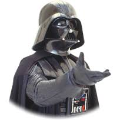

On Tuesday, we'll be planning poker. Many teams prefer to use cards for this. You can bring a deck of playing cards, or make your own. We can also use our fingers to vote without cards. If your team wants to use cards, we need 1-8 of the Fibonacci sequence for each team member: 1, 2, 3, 5, 8.

It's not uncommon for dev teams to make cards with sci-fi, or other pop-culture characters on them. For instance, you might pick a StarWars theme:

Points | Card
:------|:-----
1 | 
2 | 
3 | 
5 | 
8 | 