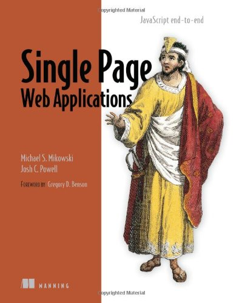

_Reintroducing JavaScript_, Chapter 2 of [Single Page Web Applications](http://www.amazon.com/Single-Page-Applications-end---end/dp/1617290750/ref=sr_1_1?s=books&amp;ie=UTF8&amp;qid=1415247669&amp;sr=1-1&amp;keywords=single+page+web+applications), is one of the best introductions to JavaScript I've seen to date.

#### After reading this chapter, you should be able to:

* Describe variable scoping, function hoisting, and the execution context object
* Explain variable scope chains and why we use them
* Create JavaScript objects using prototypes
* Write self-executing anonymous functions (iife)
* Use the module pattern and private variables

#### Why should I read this?

* In your career, if you plan on writing, testing, or managing developers who will write and test JavaScript, this will help provide you with a foundation for maintainable JavaScript design.
