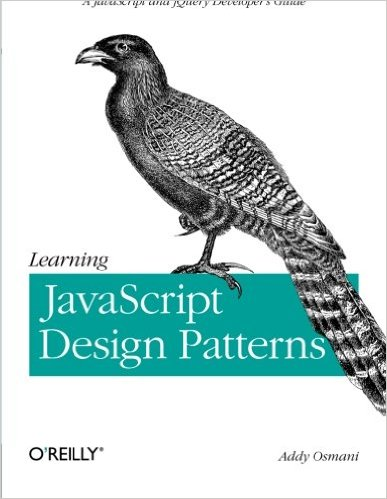
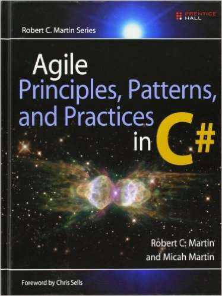

Book purchases are not required, and the books you choose to buy will differ depending on which track you, or the class chooses to follow (Node.js or .NET). All of these books provide valuable lessons that will help you in this class, and in the market.

-----------------------------

In [Single Page Web Applications](http://www.amazon.com/Single-Page-Applications-end---end/dp/1617290750/ref=sr_1_1?s=books&ie=UTF8&qid=1415247669&sr=1-1&keywords=single+page+web+applications) you'll learn to build modern browser-based apps that take advantage of stronger client platforms and more predictable bandwidth. You'll learn the SPA design approach, and then start exploring new techniques like structured JavaScript and responsive design. And you'll learn how to capitalize on trends like server-side JavaScript and NoSQL data stores, as well as new frameworks that make JavaScript more manageable and testable as a first-class language.

-----------------------------

 [Dependency Injection in .NET](http://www.amazon.com/Dependency-Injection-NET-Mark-Seemann/dp/1935182501/ref=la_B004XYGMVK_1_1?s=books&ie=UTF8&qid=1413139797&sr=1-1), winner of the 2013 Jolt Awards for Productivity, presents core DI patterns in plain C#, so you'll fully understand how DI works, covers integration with standard Microsoft technologies like ASP.NET MVC, and teaches you to use DI frameworks like Structure Map, Castle Windsor, and Unity.

> I've not found a better book on Dependency Injection, in any programming language. Regardless of what language you use, the concepts and patterns in this book are tremendously useful.

-----------------------------

With [Learning JavaScript Design Patterns](http://addyosmani.com/resources/essentialjsdesignpatterns/book/), you’ll learn how to write beautiful, structured, and maintainable JavaScript by applying classical and modern design patterns to the language. If you want to keep your code efficient, more manageable, and up-to-date with the latest best practices, this book is for you.

   

-----------------------------

With the award-winning book [Agile Software Development: Principles, Patterns, and Practices](http://www.amazon.com/gp/product/0131857258?keywords=Agile%20Principles%2C%20Patterns%2C%20and%20Practices%20in%20C%23&qid=1445809496&ref_=sr_1_1&sr=8-1), Robert C. Martin helped bring Agile principles to tens of thousands of Java and C++ programmers. Now .NET programmers have a definitive guide to agile methods with this completely updated volume from Robert C. Martin and Micah Martin, _Agile Principles, Patterns, and Practices in C#_.

  
